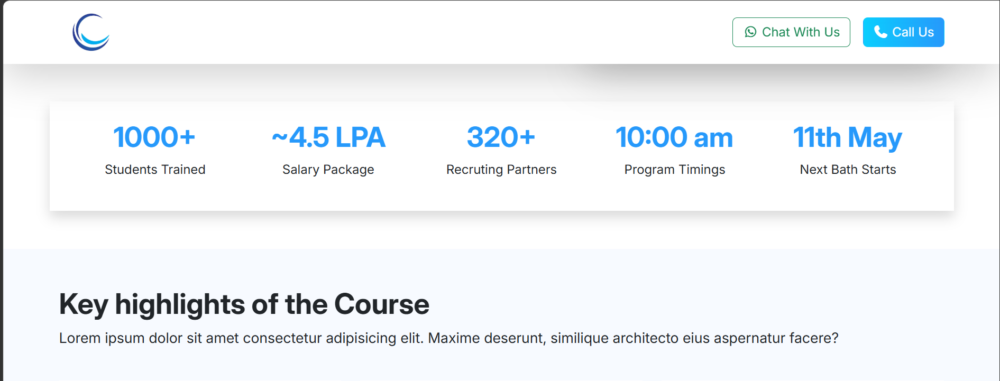
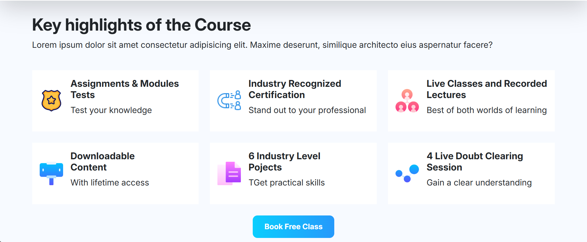
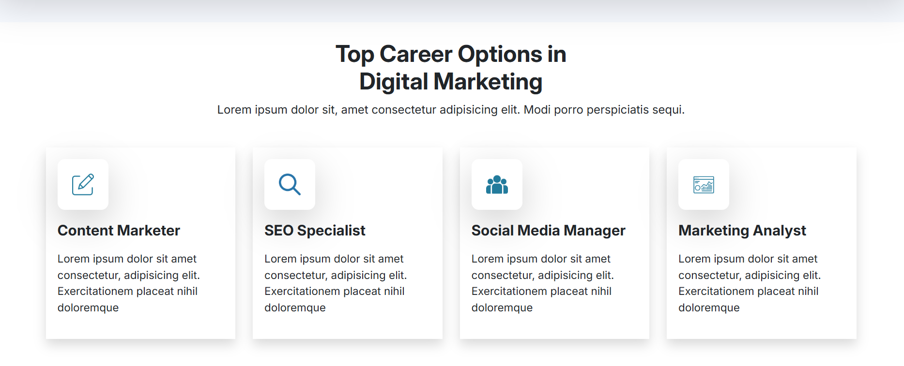
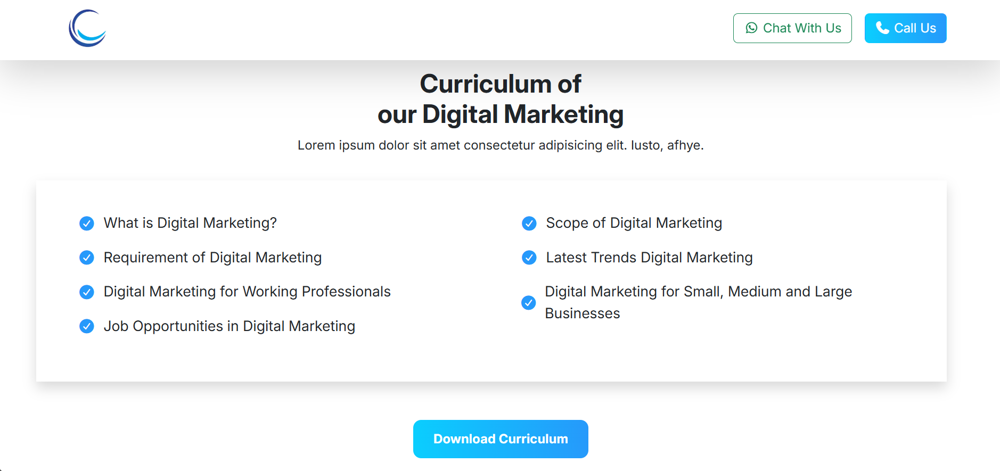
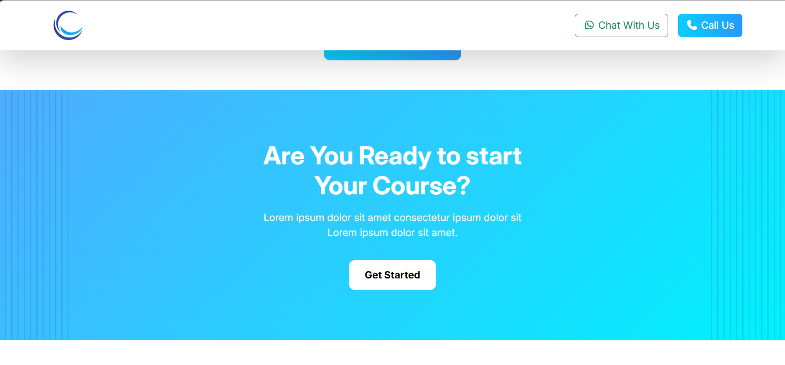
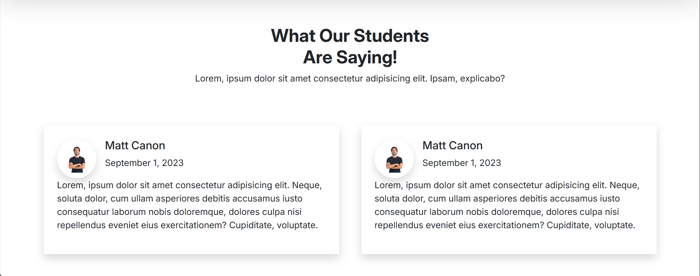

# 🎓 Digital Marketing Institute Website (Bootstrap Project)

This is a responsive website UI for a **Digital Marketing Training Institute**, built using Bootstrap.

The website represents an educational institute that offers digital marketing courses, training programs, and learning resources.

---

## 🚀 Features
- Fully responsive design (mobile + desktop)
- Built using Bootstrap 5
- Clean and modern UI layout
- Multi-section structure:
  - Hero section
  - About institute
  - Courses section
  - Testimonials (if added)
  - Contact section

---

## 🛠️ Tech Stack
- HTML5  
- CSS3  
- Bootstrap 5  

---

## 📸 Preview

### 🏠 Home Page

### 📚 Banner Section

### ℹ️ Key Highlights

### 📞 Career Section

### 🔻 Curriculum Section

### 🔻 Ready-to-start Section

### ℹ️ Feedback

### 📚 Footer

---

## 💡 What I Learned
- Bootstrap grid system
- Responsive design principles
- UI structuring for real-world institute websites
- Faster development using Bootstrap components

---

## 📌 Note
This is a frontend UI project made for learning purposes. No backend functionality is included.

---

💡 Built as part of my web development learning journey.
